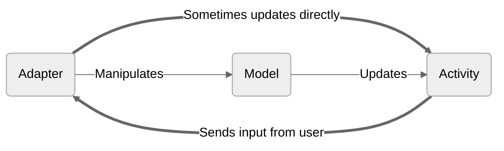
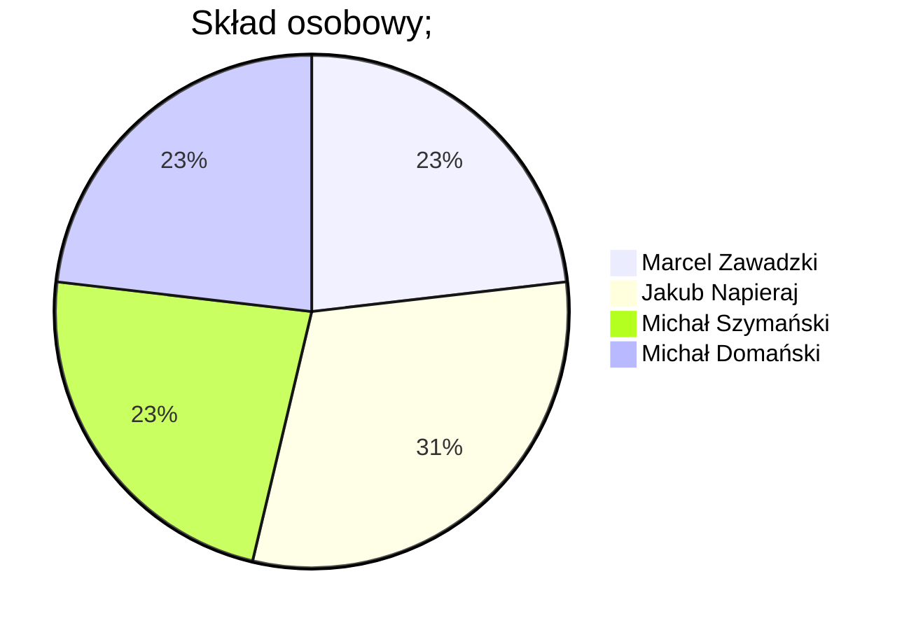

# To Do List - aplikacja na platformę Android

## Skład grupy
- Michał Domański
- Jakub Napieraj
- Michał Szymański
- Marcel Zawadzki - Scrum master

## Spis treści
- [To Do List - aplikacja na platformę Android](#to-do-list---aplikacja-na-platformę-android)
  - [Skład grupy](#skład-grupy)
  - [Spis treści](#spis-treści)
  - [Opis](#opis)
  - [Diagramy](#diagramy)
  - [Komponenty aplikacji](#komponenty-aplikacji)
    - [Activity](#activity)
    - [Adapters](#adapters)
    - [Models](#models)
    - [Utilities](#utilities)
  - [Logowanie](#logowanie)
  - [Rejestracja](#rejestracja)
  - [Ekran główny](#ekran-główny)
  - [Tworzenie zadania](#tworzenie-zadania)
  - [Powiadomienia Toast](#powiadomienia-toast)
  - [Wersje językowe](#wersje-językowe)
  - [Tryb ciemny / Tryb jasny](#tryb-ciemny--tryb-jasny)
  - [Baza danych](#baza-danych)
    - [Firebase](#firebase)
    - [Struktura bazy danych](#struktura-bazy-danych)
  - [Reklamy](#reklamy)
  - [Lista funkcjonalności](#lista-funkcjonalności)
  - [Procentowy udział członków grupy w realizacji zadań](#procentowy-udział-członków-grupy-w-realizacji-zadań)

## Opis
Aplikacja mobilna stworzona w technologii Java w środowisku Android Studio z wykorzystaniem Firebase oraz reklam Facebook'a pozwalająca na przechowywanie list rzeczy do zrobionych. Aplikacja pozwala na tworzenie list rzeczy do zrobienia przypisanych do konkretnego konta użytkownika.

## Diagramy


## Komponenty aplikacji
### Activity
Activity reprezentuje pojedynczy ekran z interfejsem użytkownika. Jest odpowiedzialna za obsługę interakcji użytkownika i wyświetlanie treści. Nasza aplikacja składa się z trzech aktywności:
- **MainActivity:** Wyświetla główny ekran naszej aplikacji, czyli listę rzeczy do zrobienia.
- **SignInActivity:** Ta aktywność służy do logowania się użytkownikó do naszej aplikacji. 
- **SignUpActivity:** Ta aktywność obsługuje funkcję rejestracji w aplikacji. Umożliwia nowym użytkownikom utworzenie konta, podając swoje dane.
  
### Adapters
Adaptery w Androidzie służą do łączenia źródeł danych z komponentami interfejsu użytkownika, które wyświetlają te dane. Zapewniają sposób wypełnienia interfejsu użytkownika danymi z modeli lub kolekcji. Oto adaptery wykorzystane w naszym projekcie: 
- **TaskAdapter:** Ten adapter służy do wyświetlania listy zadań do wykonania w komponencie interfejsu użytkownika - RecyclerView. Pobiera dane z modeli ToDo i przypisuje je do odpowiednich widoków.
- **UserAdapter:** Ten adapter służy do wyświetlania listy użytkowników w komponencie interfejsu użytkownika. Pobiera dane z modeli User i przypisuje je do odpowiednich widoków.

### Models
Modele reprezentują struktury danych lub jednostki w projekcie. Definiują właściwości i zachowania danych, które reprezentują. Modele w naszej aplikacji:
- **ToDo:** Ten model reprezentuje pojedyncze zadanie do wykonania w aplikacji. Posiada właściwości takie jak tytuł, opis, termin wykonania itp., oraz metody do interakcji z danymi zadania i manipulowania nimi.
- **User:** Ten model reprezentuje jednostkę użytkownika. Zawiera właściwości takie jak nazwa użytkownika, hasło, adres e-mail itp., oraz metody do zarządzania funkcjonalnościami związanymi z użytkownikami, takimi jak uwierzytelnianie, rejestracja itp.

### Utilities
Użyteczniki to klasy pomocnicze lub pliki, które dostarczają wspólne funkcje lub kod wielokrotnego użytku w całym projekcie:
- **Constraints:** Ten użytecznik zawiera stałe używane w całej aplikacji. Definiuje nazwy kluczy, kolekcji i innych wartości używanych w kontekście użytkowników i zadań w aplikacji.Dzięki użyciu stałych, zamiast używania bezpośrednio ciągów znaków w różnych miejscach kodu, możemy odwoływać się do stałych wartości w sposób bardziej intuicyjny i bezpieczny.
- **PreferenceManager:** To własna implementacja rozszerzenia klasy SharedPreference.

## Logowanie
Po uruchomienu aplikacji wyświetli się ekran logowania. Pozwala on na wprowadzenie danych, aby zalogować się do istniejącego konta, lub przejść do ekranu rejestracji w celu utworzenai nowego konta.


## Rejestracja
Ekran rejestracji pozwala na wprowadzenie danych potrzebnych do stworzenia nowego konta. Aplikacja sprawdza, czy użytkownik dodał zdjęcie, czy adres e-mail jest poprawny oraz, czy nie został już użyty, jak również sprawdza, czy hasła są identyczne.


## Ekran główny
Główny ekran aplikacji pozwala na dodanie nowego elementu listy rzeczy do zrobienia, wyświetla elementy listy, które już zostały otworzone, informacje o użytkowniku, takie jak zdjęcie i nazwa jego profilu, oraz przycisk, który umożliwia wylogowanie się i powrót do ekranu logowania.
Elementy wyświetlane sąw formie listy, jeden pod drugim. Przy każdym elemencie znajduje się checkbox, który pozwala zidentyfikować, czy zadanie zostało zrealizowane. Oprócz nazwy elementu, wyświetlone zostaną również zdjęcie powiązane z zadaniem oraz data, jeśli użytkownik zdecyduje się je dodać do zadania. 


## Tworzenie zadania
Kliknięcie przycisku w dolnym rogu głównej aktywności wywoła ekran dodania zadania. Użytkownik może wypisać czym ma być to zadanie, dodać datę, np. termin, przed którym zadanie musi zostać wykonane oraz zdjęcie. Wszystkie te informacje zostaną później wyświetlone w głównej aktywności.


## Powiadomienia Toast
W naszej aplikacji zaimplementowaliśmy powiadomienia typu Toast, aby użytkownik dostawał informacje zwrotne o akcjach, które wykonują sięwewnątrz aplikacji.


## Wersje językowe
Nasza implementacja listy rzeczy do zrobienia obejmuje dwie wersje językowe:
- Angielską
```XML
<?xml version="1.0" encoding="utf-8"?>
<resources>
    <string name="app_name">AndroidApp</string>
    <string name="witamy_ponownie">Welcome Back</string>
    <string name="zaloguj_si">Log In</string>
    <string name="email">E-mail</string>
    <string name="password">Password</string>
    <string name="za_nowe_konto">Create a New Account</string>
    <string name="dodaj_zdj_cie">Add Photo</string>
    <string name="imi">Name</string>
    <string name="powt_rz_has_o">Confirm Password</string>
    <string name="zarejestruj_si">Register</string>
    <string name="blad_logowania">Login Error</string>
    <string name="wprowadz_haslo">Password cannot be empty</string>
    <string name="niepoprawny_email">Invalid E-mail</string>
    <string name="wylogowanie">Logout</string>
    <string name="blad_wylogowanie">We cannot log you out.</string>
    <string name="brak_zadan">No tasks found.</string>
    <string name="wybierz_zdjecie">Choose profile photo</string>
    <string name="wprowadz_imie">Enter name</string>
    <string name="wprowadz_email">Enter E-mail</string>
    <string name="identyczne_hasla">Passwords must match</string>
    <string name="brak_uzytkownika">User not found</string>
    <string name="wprowadz_zadanie">Write your task here</string>
    <string name="zapisz">Save</string>
    <string name="data">Date</string>
    <string name="dodaj_zdjecie">Add photo</string>
</resources>
```
- Polską
```XML
<?xml version="1.0" encoding="utf-8"?>
<resources>
    <string name="app_name">Aplikcja</string>
    <string name="witamy_ponownie">Witamy Ponownie</string>
    <string name="zaloguj_si">Zaloguj się</string>
    <string name="email">E-mail</string>
    <string name="password">Hasło</string>
    <string name="za_nowe_konto">Załóż nowe konto</string>
    <string name="dodaj_zdj_cie">Dodaj zdjęcie</string>
    <string name="imi">Imię</string>
    <string name="powt_rz_has_o">Powtórz Hasło</string>
    <string name="zarejestruj_si">Zarejestruj się</string>
    <string name="blad_logowania">Błąd Logowania</string>
    <string name="wprowadz_haslo">Wprowadź hasło</string>
    <string name="niepoprawny_email">Niepoprawny E-mail</string>
    <string name="wylogowanie">Wylogowanie</string>
    <string name="blad_wylogowanie">Nie możemy ciebie wylogować</string>
    <string name="brak_zadan">Nie znaleziono zadań</string>
    <string name="wybierz_zdjecie">Wybierz zdjęcie profilowe</string>
    <string name="wprowadz_imie">Wprowadź imię</string>
    <string name="wprowadz_email">Wprowadź E-mail</string>
    <string name="identyczne_hasla">Hasła muszą być takie same</string>
    <string name="brak_uzytkownika">Nie znaleziono użytkownika</string>
    <string name="wprowadz_zadanie">Zapisz swoje zadanie</string>
    <string name="zapisz">Zapisz</string>
    <string name="data">Data</string>
    <string name="dodaj_zdjecie">Dodaj zdjęcie</string>

</resources>
```

## Tryb ciemny / Tryb jasny
Daliśmy użytkownikowi możliwość wyboru zmiany pomiędzy jasnym, a ciemnym trybem wyświetlania aplikacji. Wygląd aplikacji uzależniony jest od systemowego trybu wyświetlania.
- Jasny
```XML
<resources xmlns:tools="http://schemas.android.com/tools">
    <style name="Theme.AndroidApp" parent="Theme.MaterialComponents.DayNight.NoActionBar">
        <item name="colorPrimary">@color/primary</item>
        <item name="android:statusBarColor">@color/primary</item>
        <item name="android:background">@color/white</item>
        <item name="android:colorButtonNormal">@color/error</item>
    </style>
</resources>
```
- Ciemny
```XML
<resources xmlns:tools="http://schemas.android.com/tools">
    <style name="Theme.AndroidApp.Dark" parent="Theme.MaterialComponents.DayNight.NoActionBar">
        <item name="colorPrimary">@color/primary</item>
        <item name="android:statusBarColor">@color/primary_dark</item>
        <item name="android:background">@color/primary_dark</item>
        <item name="android:textColor">@color/white</item>
    </style>
</resources>
```
## Baza danych

### Firebase
Firebase to zestaw narzędzi oferowanych przez firmę Google, które umożliwiają tworzenie aplikacji mobilnych i internetowych. Wśród tych narzędzi znajduje się baza danych NoSQL, która może być używana w aplikacjach na Androida.
Aby skorzystać z bazy danych Firebase w aplikacji na Androida, musieliśmy zarejestrować się i utworzyć projekt w konsoli Firebase. Następnie dołączyliśmy biblioteki Firebase do aplikacji za pomocą gradle i skonfigurować połączenie z bazą danych w pliku AndroidManifest.xml. Po skonfigurowaniu połączenia z bazą danych, można już korzystać z bazy danych Firebase w aplikacji na Androida poprzez wywoływanie odpowiednich metod API Firebase.
```JAVA
    private void getToken() {
        FirebaseMessaging.getInstance().getToken().addOnSuccessListener(this::updateToken);
    }

    private void updateToken(String token) {
        FirebaseFirestore database = FirebaseFirestore.getInstance();
        DocumentReference documentReference =
                database.collection(Constants.KEY_COLLECTION_USERS).document(
                        preferenceManager.getString(Constants.KEY_USER_ID)
                );
        documentReference.update(Constants.KEY_FCM_TOKEN, token)
                .addOnFailureListener(e -> showToats("Nie mogę update'ować token'a"));
    }
```
### Struktura bazy danych
Stworzyliśmy dwie kolekcje. Jedna odpowiada za zadania, a druga za informacje o użytkownikach.
- Struktura zadań


- Struktura użytkowników
  


Wykorzystanie Firebase pozwala nam również na przechowywanie zdjęć w bazie. Są one przechowywane pod postacią plików .JPG.


## Reklamy
W naszej aplikacji udało nam się zaimplementować reklamy Facebook'a. Reklamy wyświetlają się na ekranie logowania w postaci banera przy dolnej krawędzi ekranu.


## Lista funkcjonalności
Niestety pomimo wszelkich starań nie udało nam się zaimplementować wszystkich funkcjonalności zadeklarowanych na początku projektu. Natomiast udało nam się stworzyć działającą aplikację, która zawiera wszystkie potrzebne elementy, aby móc nazwać ją pełnoprawną aplikacją TO DO LIST. 

 - [x] Logowanie, rejestracja
 - [ ] Powiadomienia, przypomnienia
 - [x] Dark Mode
 - [ ] Kategorie, grupowanie 4 kategorie
 - [ ] Wysyłanie przez bluetooth
 - [x] Wysylanie Firebase
 - [x] Tworzenie, edycja, usuwanie notatek, tekst, pinezka, obrazek
 - [ ] Nawigacja do pinezki z notatki
 - [x] Reklamy
 - [x] Dwie wersje językowe PL/EN

## Procentowy udział członków grupy w realizacji zadań

